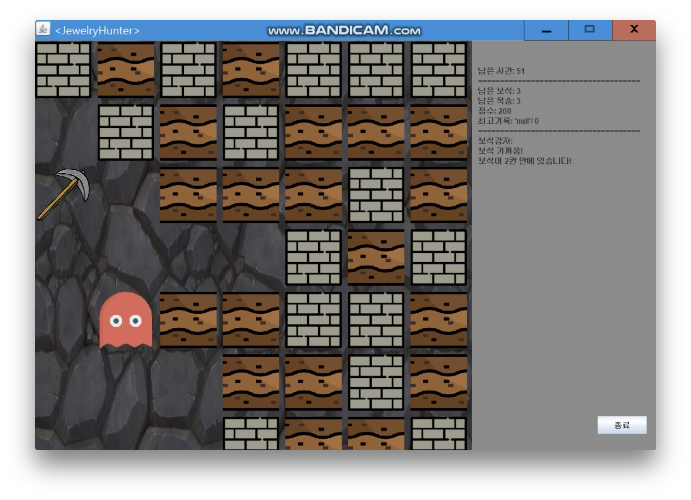

# Jewelry_Hunter
<!--Project Buttons-->
 [![Readme in Korean][readme-ko-shield]][readme-ko-url] [![View Demo][view-demo-shield]][view-demo-url]
 
Java Project - Team Project, Associated with SungKongHoe University  
Period : 2nd Semester 2017

A game where players avoid monsters, destroy obstacles, and collect as many jewels as possible within a limited time.

## Members
- Jowoon Kim - [@NiceKim](https://github.com/NiceKim)
  - Project Leader
  - Implemente game objects (monsters, types), game & systems (code framework, player movement, jewel detection, timer, score).
- Jiyeon Kim - [@gno0929](https://github.com/gno0929)
  - UI Design, implemented the basic structure and detailed design of the user interface.
- Jieun Kim - [@kje6445](https://github.com/kje6445)
  - Game Objects (Rocks, Gems) & GUI Design Worked on implementing graphical user interface (GUI).
- Youngbin Han - [@sukso96100](https://github.com/sukso96100)
  - Implemented game objects (Rocks, Gems), game systems (Map Coordinates Implementation, Object Interaction), Code (Package) Organization

## Screenshots and video

[**Demo video**](https://youtu.be/aLrWUD4ksNk)  

<!--Url for Buttons-->
[readme-ko-shield]: https://img.shields.io/badge/-readme%20in%20korean-2E2E2E?style=for-the-badge
[view-demo-shield]: https://img.shields.io/badge/-%F0%9F%98%8E%20view%20demo-F3F781?style=for-the-badge
[view-demo-url]: https://youtu.be/aLrWUD4ksNk
[readme-ko-url]: master/README-KO.md
